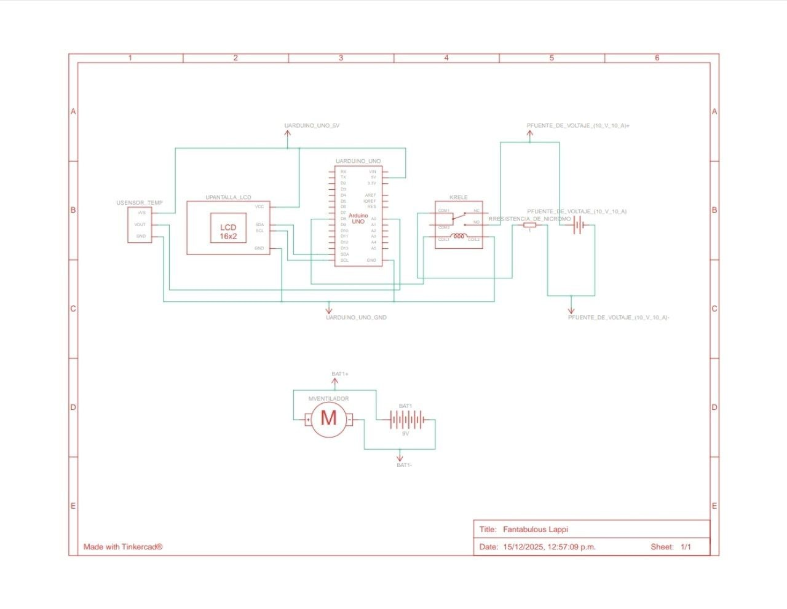

# Automated Temperature Control System (IoT Basics)

## 📌 Description
This repository contains the embedded C++ logic and documentation for an automated climate control system. Developed as a final project for Microelectronics at Universidad Autónoma Metropolitana (UAM), the system autonomously regulates environmental temperature using an Arduino UNO, providing real-time data visualization through an I2C LCD.

## 🛠️ Hardware & Tech Stack
* Microcontroller: Arduino UNO
* Sensor: LM35 Precision Centigrade Temperature Sensor
* Actuators: 5V/10A Relay controlling a custom 16-gauge Nichrome wire heater and a forced-air cooling fan
* Display: LCD screen (I2C interface)

## ⚙️ Logic & Architecture
The control flow implements a stable reading mechanism to avoid hardware jitter:
1. The Arduino reads the analog signal from the LM35 sensor.
2. To ensure stability, the system averages 5 sensor readings with a 500ms delay between them.
3. Threshold activation: If the averaged temperature drops to or below 15°C, the Arduino triggers digital pin 8.
4. Pin 8 activates the relay, which safely powers the external 12V/12A heating and ventilation circuit.

🎥 [Watch the system in action (Video Demo)](https://youtu.be/-xH9s5bYYJg)

## 🔧 Engineering Challenges & Hardware Troubleshooting
During development, the power stage required significant troubleshooting. Initially, we attempted to drive the Nichrome wire using operational amplifiers. When they couldn't supply enough current, we switched to a MOSFET, which ultimately failed and burned out due to the high current demand. 

The final, stable architecture isolates the microcontroller from the high-power load using a dedicated 10A relay, ensuring both the safety of the logic board and the operational stability of the heating element.

## 🔐 DevSecOps & Future Iterations
Currently, this system operates as an isolated, closed-loop embedded device. As I transition into Cloud and DevSecOps, the next iteration of this project involves connecting the sensor data to AWS via an ESP32 or Raspberry Pi. The primary focus for the V2 will be implementing secure data transmission (MQTT over TLS) and ensuring the IoT endpoints are protected against unauthorized access.

## 📚 What I Learned
- Hardware isolation principles: separating logic circuits 
  from high-power loads using relays
- Analog signal averaging to eliminate sensor noise
- Iterative hardware debugging: op-amp → MOSFET → relay 
  progression taught me to validate current requirements 
  before component selection
- Embedded C++ memory optimization for resource-constrained 
  environments

## 🚀 How to Replicate
1. Upload temperature_control.ino to Arduino UNO via Arduino IDE
2. Connect LM35 to analog pin A0
3. Connect relay signal pin to digital pin 8
4. Power the 12V circuit independently from the Arduino
5. Monitor temperature readings on I2C LCD